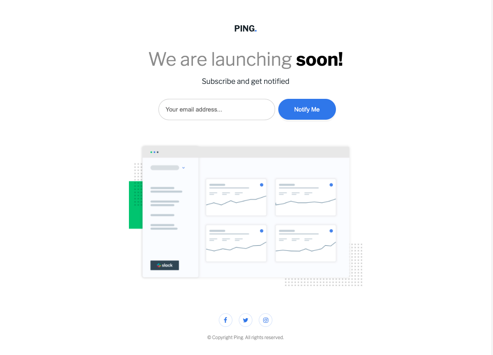
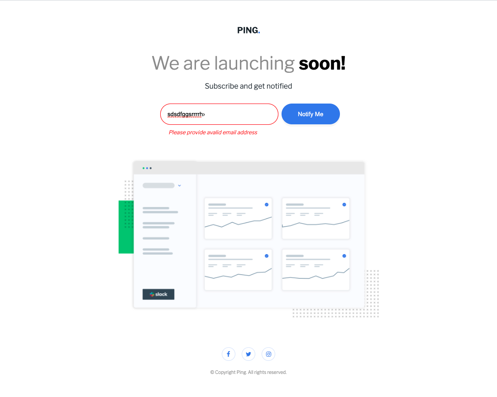
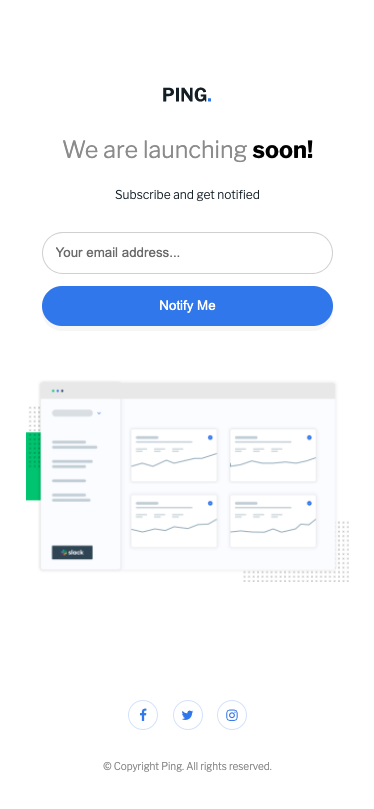

# Frontend Mentor - Ping coming soon page solution

This is a solution to the [Ping coming soon page challenge on Frontend Mentor](https://www.frontendmentor.io/challenges/ping-single-column-coming-soon-page-5cadd051fec04111f7b848da). Frontend Mentor challenges help you improve your coding skills by building realistic projects. 

## Table of contents

- [Overview](#overview)
  - [The challenge](#the-challenge)
  - [Screenshot](#screenshot)
  - [Links](#links)
- [My process](#my-process)
  - [Built with](#built-with)
  - [What I learned](#what-i-learned)
  - [Continued development](#continued-development)
  - [Useful resources](#useful-resources)
- [Author](#author)
- [Acknowledgments](#acknowledgments)

## Overview

### The challenge

Users should be able to:

- View the optimal layout for the site depending on their device's screen size
- See hover states for all interactive elements on the page
- Submit their email address using an `input` field
- Receive an error message when the `form` is submitted if:
	- The `input` field is empty. The message for this error should say *"Whoops! It looks like you forgot to add your email"*
	- The email address is not formatted correctly (i.e. a correct email address should have this structure: `name@host.tld`). The message for this error should say *"Please provide a valid email address"*

### Screenshot





### Links

- Solution URL: [Portfolio](https://gelatodigital.com/portfolio)
- Live Site URL: [Add live site URL here](https://your-live-site-url.com)

## My process

### Built with

- Semantic HTML5 markup
- CSS custom properties
- Flexbox
- CSS Grid
- Mobile-first workflow

### What I learned

The icon/svg are easy to set up if you know how to wrap them. Also, the transition property makes things more elegant. Also, the hover and active states can be combined into one thing to save time.

```css
.submit:active, .submit:hover{
    background-color: hsl(223, 87%, 63%, 0.5);
    cursor: pointer;
    transition: 0.5s;
}
```
The blue circle around input tags can also be managed
```css
input:focus {
    outline: none;
}
```

### Continued development

Still not 100% secured with email validation. I'll try to keep it on css without making the default state of the website have the error message

### Useful resources

- [buttons with good taste](https://codepen.io/Marina_Os/pen/OJyWPbL)

- [get rid of input highlight](https://stackoverflow.com/questions/1457849/how-to-remove-the-border-highlight-on-an-input-text-element)

## Author

- Website - [Rodrigo](https://www.gelatodigital.com)
- Frontend Mentor - [@Rod-Barbosa](https://www.frontendmentor.io/profile/Rod-Barbosa)

## Acknowledgments

Thanks once again to my mentor [Fred](@http://www.fredericobichara.com/)
The buttons with elegant design are really helpful
